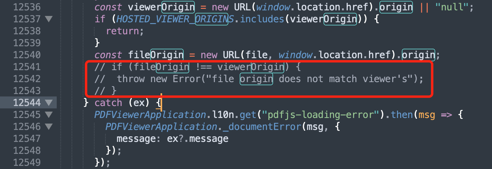

收录经过整合和验证的Hexo-Next配置方案，主要内容来自于网络技术文章，并给出出处，感谢网络大佬们的分享~

**修改超链接颜色**
- [Hexo Next 修改超链接颜色](https://blackchy.com/2019/09/30/2019-09-30-Hexo-Next-Link-Color/)
- [Hexo Next博客优化](https://maoao530.github.io/2017/01/25/hexo-blog-seo/)
在./themes/next/source/css/_custom/custom.styl里添加如下代码
``` css
.post-body a:not(.btn){
  color: #0593d3;
  border-bottom: none;
  &:hover {
    color: #0477ab;
    text-decoration: underline;
  }
}
```
a:not(.btn)避免修改首页的”阅读全文”按钮的样式

**嵌入pdf文件**
- [如何在hexo博客中嵌入PDF](https://yuzhang.net/2023/11/07/如何在hexo博客中嵌入PDF/)
- [PDF.js for NexT](https://github.com/next-theme/theme-next-pdf)

1. 在source目录下新建`scripts`目录，下载[`pdfjs`](https://mozilla.github.io/pdf.js/getting_started/#download)放入其中
2. 修改pdfjs中的`web/viewer.mjs`文件
    
3. 修改配置文件`_config.yml`, 将`scripts`目录添加到跳过渲染配置
   ``` javascript
   skip_render: [scripts/**]
   ```
4. 将pdf文件放到`source`目录下，比如`source/pdfs`
5. 添加pdf文件到md文件
   ``` js
   <iframe src="/scripts/pdfjs-4.10.38/web/viewer.html?file=/pdfs/example.pdf" style='width:100%;height:800px'></iframe>
   ```
> **Note** pdf文件路径应改为`/pdfs/*.pdf`

示例如下，来源[The-Art-of-Linear-Algebra.pdf](https://github.com/kenjihiranabe/The-Art-of-Linear-Algebra/blob/main/The-Art-of-Linear-Algebra.pdf)：
<iframe src="/scripts/pdfjs-4.10.38/web/viewer.html?file=/pdfs/The-Art-of-Linear-Algebra.pdf" style='width:100%;height:400px'></iframe>

**嵌入图表**
- [Fluid Theme](https://github.com/fluid-dev/hexo-theme-fluid)
- [使用 ECharts 插件绘制炫酷图表](https://hexo.fluid-dev.com/posts/hexo-echarts/)
