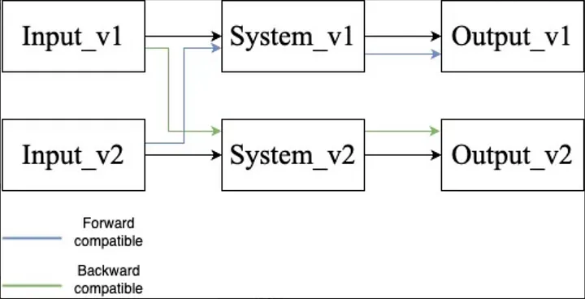

OpenGL目前的最新版本是2017年发布的4.6版本，OpenGL老矣也不会再有更新了。尽管OpenGL是一套简单易用的图形API，但是很明显它并没有紧跟图形技术发展的脉搏，不仅仅落后于同时代的DirectX，其自身标准的取舍也使其变的碎片化。模式和兼容性就是其中恶心的一点，本文便是记录GLFW3在创建OpenGL上下文时设置模式和兼容性所设置的一些字段。

以前用GLFW3和OpenGL做一些demo时候，`glfwWindowHint`随意复制粘贴一下然后设置一下OpenGL Context的版本和Profile即可，并没有过多理会其他的字段的含义和差别。毕竟使用`Modern OpenGL`或者`Core Profile`的OpenGL，并不需要在意兼容模式下大量的固定管线API的功能。但是，当实际使用中涉及到了`glLineWidth`这种从上古时代OpenGL 2.0时期延续至今并在OpenGL 4.6中Deprecated的API，更骚气的是其能不能work还要取决于硬件能力和驱动实现，多重buff于一身，某些字段的设置开始变的微妙起来了。

``` cpp
glfwWindowHint(GLFW_OPENGL_PROFILE, GLFW_OPENGL_CORE_PROFILE);
// glfwWindowHint(GLFW_OPENGL_FORWARD_COMPAT, GLFW_TRUE);
glfwWindowHint(GLFW_CONTEXT_VERSION_MAJOR, 4);
glfwWindowHint(GLFW_CONTEXT_VERSION_MINOR, 6);
glfwWindowHint(GLFW_SAMPLES, 4);
glfwWindowHint(GLFW_SCALE_TO_MONITOR, GLFW_TRUE);

std::cout << "Vendor  " << glGetString(GL_VENDOR) << std::endl;
std::cout << "Render  " << glGetString(GL_RENDERER) << std::endl;
std::cout << "GL      " << glGetString(GL_VERSION) << std::endl;
std::cout << "GLSL    " << glGetString(GL_SHADING_LANGUAGE_VERSION) << std::endl;
GLint profile;
glGetIntegerv(GL_CONTEXT_PROFILE_MASK, &profile);
std::cout << "Profile " << (profile & GL_CONTEXT_CORE_PROFILE_BIT ? "Core" : "Compatibility") << std::endl;
```

这其中一不小心复制了却不知道意义最终影响了结果的字段非`GLFW_OPENGL_FORWARD_COMPAT`莫属，而且要和`GLFW_OPENGL_PROFILE`一同食用为佳。`GLFW_OPENGL_FORWARD_COMPAT`设置OpenGL的向前兼容性，先来了解一下什么是兼容性，简单来说就是：
- 旧输入，用在新系统，就是向后兼容
- 新输入，用在旧系统，就是向前兼容

OpenGL中compatibility和profile是两个不同的概念，设置了Forward compatibility的作用是：
> For 3.2+ compatibility, it should mean nothing at all. Since no functionality is marked deprecated in the compatibility profile, the forward compatibility bit removes nothing.
> For 3.2+ core, it again means that all functionality that is still deprecated (wide-lines) will be removed.

看看GLFW官方文档的[解释](https://www.glfw.org/docs/3.3/window_guide.html)，特别注意的是macOS如果创建3.2+版本，只支持前向兼容的核心模式（macOS的OpenGL只支持的4.1，万恶的水果）:
> GLFW_OPENGL_FORWARD_COMPAT specifies whether the OpenGL context should be forward-compatible, i.e. one where all functionality deprecated in the requested version of OpenGL is removed. This must only be used if the requested OpenGL version is 3.0 or above. If OpenGL ES is requested, this hint is ignored.
> **Note** macOS: The OS only supports forward-compatible core profile contexts for OpenGL versions 3.2 and later.

这也解释了为啥`glLineWidth`在前向兼容模式线没作用了，不过是在硬件支持wideline的前提下。

 图片来自[Backward and Forward Compatibilities](https://medium.com/@wangberlin2000/backward-and-forward-compatibilities-a71e52683627)


其他窗口系统也有类似的字段设置，比如WGL的`WGL_CONTEXT_FORWARD_COMPATIBLE_BIT_ARB`和`WGL_CONTEXT_CORE_PROFILE_BIT_ARB`，大同小异，都是映射到OpenGL上下文的相应配置。
``` cpp
// 4.6 forward compatible core profile
	const int attribs[] = {
		WGL_CONTEXT_MAJOR_VERSION_ARB, 4,
		WGL_CONTEXT_MINOR_VERSION_ARB, 6,
		WGL_CONTEXT_LAYER_PLANE_ARB, 0, // main plane
		WGL_CONTEXT_FLAGS_ARB, WGL_CONTEXT_FORWARD_COMPATIBLE_BIT_ARB | WGL_CONTEXT_DEBUG_BIT_ARB,
		WGL_CONTEXT_PROFILE_MASK_ARB, WGL_CONTEXT_CORE_PROFILE_BIT_ARB,
		0
	};
	
	// wglCreateContextAttribsARB https://www.khronos.org/registry/OpenGL/extensions/ARB/WGL_ARB_create_context.txt
	HGLRC gl_context = wglCreateContextAttribsARB(dc, NULL, attribs);
```


**参考**
- [GLFW: Window guide](https://www.glfw.org/docs/3.3/window_guide.html)
- [Core And Compatibility in Contexts](https://www.khronos.org/opengl/wiki/OpenGL_Context#Context_types)
- [How to request a specific OpenGL version?](https://gamedev.stackexchange.com/questions/30441/how-to-request-a-specific-opengl-version)
- [Detect the OpenGL context profile before version 3.2](https://stackoverflow.com/questions/73745603/detect-the-opengl-context-profile-before-version-3-2)
- [Backward and Forward Compatibilities](https://medium.com/@wangberlin2000/backward-and-forward-compatibilities-a71e52683627)
- [WGL Full Demo](https://gist.github.com/tilkinsc/7f383faccf3722622f5d0cc9bd45e7e6)