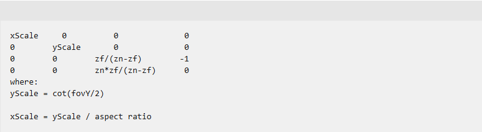

`D3DXMatrixPerspectiveFovRH ` [D3DXMatrixPerspectiveFovRH](https://learn.microsoft.com/en-us/windows/win32/direct3d9/d3dxmatrixperspectivefovrh?redirectedfrom=MSDN)

# 参考
- [Reversed-Z in OpenGL](https://nlguillemot.wordpress.com/2016/12/07/reversed-z-in-opengl/)
- [glClipControl](https://registry.khronos.org/OpenGL-Refpages/gl4/html/glClipControl.xhtml)
- [Depth Precision](https://web.archive.org/web/20200427121222/http://dev.theomader.com/depth-precision/)
- [Visualizing Depth Precision](https://developer.nvidia.com/blog/visualizing-depth-precision/)
- [Reverse Depth Buffer in OpenGL](https://www.danielecarbone.com/reverse-depth-buffer-in-opengl/)
- [OpenGL Projection Matrix](https://www.songho.ca/opengl/gl_projectionmatrix.html)
- [Attack of the depth buffer](https://mynameismjp.wordpress.com/2010/03/22/attack-of-the-depth-buffer/)
- [glm perspectiveRH_ZO](https://github.com/g-truc/glm/blob/master/glm/ext/matrix_clip_space.inl#L233)