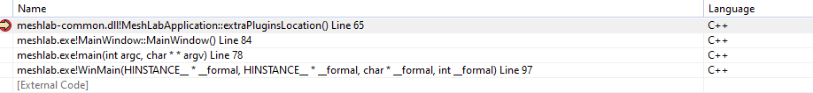
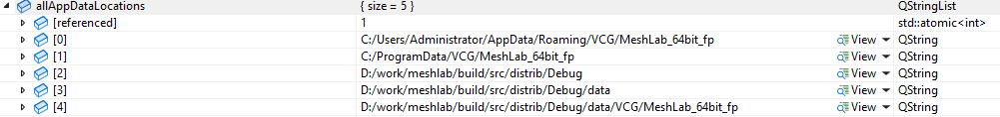
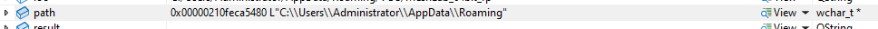

**MeshLab调试时加载的dll版本不对**

从[MeshLab 2023.12](https://www.meshlab.net/#download)下载安装的`2023.12`版本，我在本地clone了一份源码编译，发现在`C:\Users\Administrator\AppData\Roaming\VCG\MeshLab_64bit_fp\MeshLabExtraPlugins\2023.12`位置存放了一套插件的dll文件，也就是这一套dll文件影响了源码的调试，也即调试时加载的这个目录下的dll文件，不是生成路径下的dll文件。

根据调用栈加载dll的路径就是这个路径：
<!--  -->


[MeshLabApplication::extraPluginsLocation](https://github.com/cnr-isti-vclab/meshlab/blob/main/src/common/mlapplication.cpp#L58C1-L75C2)看出，`appVer`也出了力。但是核心路径还是来自于`QStandardPaths::standardLocations(QStandardPaths::AppDataLocation).first()`。
``` c++
const QString MeshLabApplication::extraPluginsLocation()
{
	QDir appDir(QStandardPaths::standardLocations(QStandardPaths::AppDataLocation).first());
	appDir.mkpath(appDir.absolutePath());
	
	appDir.mkdir("MeshLabExtraPlugins");
	appDir.cd("MeshLabExtraPlugins");
	
	//QString major = appVer().left(4);
	//appDir.mkdir(major);
	//appDir.cd(major);

	//just for first versions, compatibility of plugins is fixed for same version of meshlab
	appDir.mkdir(appVer());
	appDir.cd(appVer());

	return appDir.absolutePath();
}
```

可以看一下`QStandardPaths::standardLocations`的内容，可以添加上：
``` c++
    #include <QDebug>
    #include <Windows.h>
    #include <shlobj_core.h>
	QStringList allAppDataLocations =
		QStandardPaths::standardLocations(QStandardPaths::AppDataLocation);
	// QString loc = QStandardPaths::writableLocation(QStandardPaths::AppDataLocation);
	foreach (QString path, allAppDataLocations) {
		qInfo() << path;
	}
	auto s = appDir.absolutePath();
	LPWSTR  path;
	SHGetKnownFolderPath(FOLDERID_RoamingAppData, KF_FLAG_DONT_VERIFY, 0, &path); 
```

**QStandardPaths::standardLocations(QStandardPaths::AppDataLocation)是个啥**

`QStandardPaths::standardLocations(QStandardPaths::AppDataLocation)`返回的是`QStringList`类型，本地测试如下，有5个路径，`extraPluginsLocation`用的就是第一个路径。

<!--  -->


**路径来源**

deepseek了解了一下，`setOrganizationName`和`setApplicationName`会影响到这个路径，细节就没有了，也没有chat到为啥多个路径。`setOrganizationName`和`setApplicationName`在[meshlab/main.cpp](https://github.com/cnr-isti-vclab/meshlab/blob/main/src/meshlab/main.cpp#L62)中都调用到了。
``` c++
	QCoreApplication::setOrganizationName(MeshLabApplication::organization());

	QString tmp = MeshLabApplication::appArchitecturalName(MeshLabApplication::HW_ARCHITECTURE(QSysInfo::WordSize));
	QCoreApplication::setApplicationName(MeshLabApplication::appArchitecturalName(MeshLabApplication::HW_ARCHITECTURE(QSysInfo::WordSize)));
```


具体原因只能看具体实现了，源码面前，了无秘密。来看一看`QStandardPaths::standardLocations`的定义，在[qstandardpaths_win.cpp](https://github.com/qt/qtbase/blob/dev/src/corelib/io/qstandardpaths_win.cpp#L224)中。
``` c++
QStringList QStandardPaths::standardLocations(StandardLocation type)
{
    QStringList dirs;
    const QString localDir = writableLocation(type);
    if (!localDir.isEmpty())
        dirs.append(localDir);

    // type-specific handling goes here
    if (isConfigLocation(type)) {
        QString programData = sHGetKnownFolderPath(FOLDERID_ProgramData);
        if (!programData.isEmpty()) {
            if (!isGenericConfigLocation(type))
                appendOrganizationAndApp(programData);
            dirs.append(programData);
        }
#ifndef QT_BOOTSTRAPPED
        // Note: QCoreApplication::applicationDirPath(), while static, requires
        // an application instance. But we might need to resolve the standard
        // locations earlier than that, so we fall back to qAppFileName().
        QString applicationDirPath = qApp ? QCoreApplication::applicationDirPath()
            : QFileInfo(qAppFileName()).path();
        dirs.append(applicationDirPath);
        const QString dataDir = applicationDirPath + "/data"_L1;
        dirs.append(dataDir);

        if (!isGenericConfigLocation(type)) {
            QString appDataDir = dataDir;
            appendOrganizationAndApp(appDataDir);
            if (appDataDir != dataDir)
                dirs.append(appDataDir);
        }
#endif // !QT_BOOTSTRAPPED
    } // isConfigLocation()

    return dirs;
}
```

可以看到，`QStandardPaths::standardLocations`正好有5个`append`操作，正对着`QStandardPaths::standardLocations(QStandardPaths::AppDataLocation)`返回的5条路径，其中第一条来自于`writableLocation`设置，并附加了`appendOrganizationAndApp`名称。递归一下，`writableLocation`的实现基本如下：

``` c++
#include <Windows.h>
#include <shlobj_core.h>
LPWSTR  path;
// FOLDERID_Programs,      // ApplicationsLocation
SHGetKnownFolderPath(FOLDERID_RoamingAppData, KF_FLAG_DONT_VERIFY, 0, &path); 
```

path结果，不出所料，正是：
<!--  -->


**调试方法**

如果修改的dll恰巧也在`C:\Users\Administrator\AppData\Roaming\VCG\MeshLab_64bit_fp\MeshLabExtraPlugins\2023.12`目录下，把生成结果copy到该目录下，就可以正常调试了。