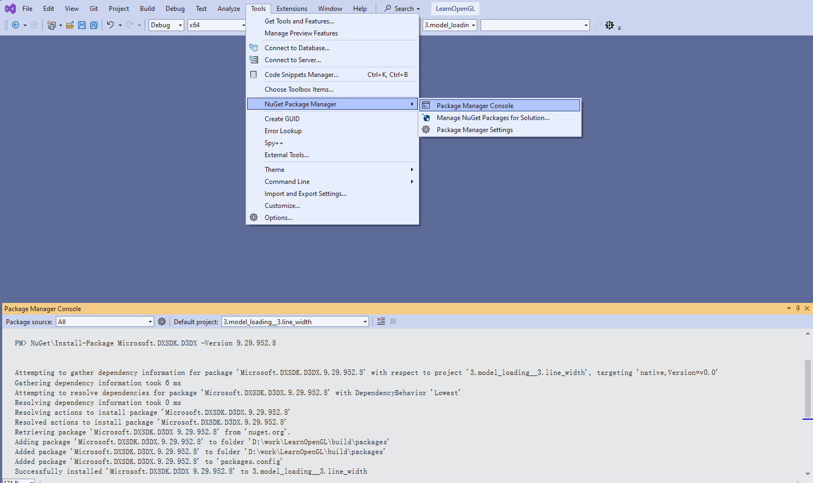

# 背景
`DirectX SDK`自从`Windows 8 SDK`开始，是随着`Windows SDK`附带的，包含了各个历史版本的头文件、动态库和工具集，但是这些历史版本SDK的sample和辅助库D3DX9、D3DX10、D3DX11等就被丢弃了。

偶尔会遇到一些D3D的旧版本上古demo，可能就使用了一些旧版本的辅助函数，比如在看SSS效果的时候使用的iryokudl大佬的[separable-sss](https://github.com/iryoku/separable-sss)，仅仅依赖`Windows SDK`附带的DX依赖没法正确跑起来。

# 替代

walbourn大佬致力于历史版本的D3DX缺失后而不使用就版本redist安装的替代方案，开源了[Microsoft.DXSDK.D3DX](https://www.nuget.org/packages/Microsoft.DXSDK.D3DX)，同时给出了历史版本开发替换建议。

> Direct3D 9: There are limited replacements for the functionality in D3DX9 if you are still using Direct3D 9. You can make use of D3DCompile APIs directly with the legacy DirectX SDK, but newer versions of the D3DCompile DLL in the Windows 8.x SDK are not compatible with Windows XP for runtime use. You can use DirectXMath for Direct3D 9 instead of D3DXMath or XNAMath via NuGet. You can find Direct3D 9 versions of DDSTextureLoader, WICTextureLoader, and ScreenGrab on GitHub. You can use DirectXTex and DirectXMesh when preparing content for use by Direct3D 9 (the texconv tool supports a -dx9 switch for this purpose).[Living without D3DX](https://walbourn.github.io/living-without-d3dx/)

>Direct3D 10: The best option for Direct3D 10.x applications is to update them to use Direct3D 11, and then utilize all the options here to replace legacy D3XD10. Porting the API is very straightforward, and Direct3D 11 is available on all supported platforms that have Direct3D 10.[Living without D3DX](https://walbourn.github.io/living-without-d3dx/)

>Direct3D 12: There is a header that ships in the DirectX 12 samples on GitHub called d3dx12.h. It is all inline utility header which has no DLL or redistributable dependency, and can be used under the MIT license. It is not included in the Windows SDK. If you are looking for additional functionality, see the DirectX Tool Kit for DirectX 12, DirectXTex and DirectXMesh.[Living without D3DX](https://walbourn.github.io/living-without-d3dx/)

# nuget包管理

是开源的包管理软件，`Visual Studio`自从`VS2012`开始集成，`Microsoft.DXSDK.D3D`就可以通过`NuGet`方便的安装使用。

# Legacy DirectX samples

[directx-sdk-legacy-samples](https://github.com/walbourn/directx-sdk-legacy-samples)
> This repo contains Direct3D 9, Direct3D 10, a few Direct3D 11, and DirectSound C++ samples from the legacy DirectX SDK updated to build using the Windows 10 SDK and the Microsoft.DXSDK.D3DX NuGet package

[directx-sdk-samples](https://github.com/walbourn/directx-sdk-samples)
> This repo contains Direct3D 11, XInput, and XAudio2 samples C++ samples from the legacy DirectX SDK updated to build using the Windows 10 SDK

[microsoft/DirectX-SDK-Samples](https://github.com/microsoft/DirectX-SDK-Samples)
> This repository contains an archive of DirectX samples that shipped in the legacy DirectX SDK. They have been updated to build with Visual Studio 2019 or later, require only the current Windows SDK, and make use the Microsoft.DXSDK.D3DX NuGet package.

# 参考
- [Why d3dx is deprecated?](https://stackoverflow.com/questions/60874509/why-d3dx-is-deprecated)
- [Living without D3DX](https://walbourn.github.io/living-without-d3dx/)
- [Microsoft.DXSDK.D3DX 9.29.952.8](https://www.nuget.org/packages/Microsoft.DXSDK.D3DX)