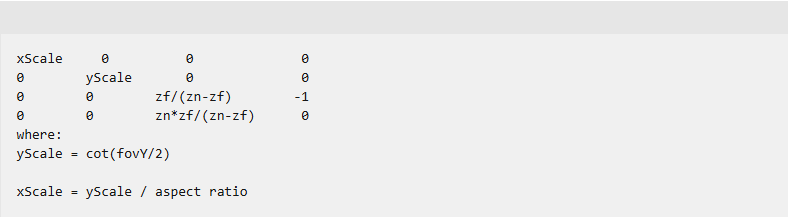

# How near and far planes affet depth percision

- [My openGL render depths are nearly the value of 1 why is that?](https://stackoverflow.com/questions/25755853/my-opengl-render-depths-are-nearly-the-value-of-1-why-is-that)
- [depth buffer got by glReadPixels is always 1](https://stackoverflow.com/questions/16768090/depth-buffer-got-by-glreadpixels-is-always-1)
- [How am I able to perform perspective projection without a near plane?](https://computergraphics.stackexchange.com/questions/5116/how-am-i-able-to-perform-perspective-projection-without-a-near-plane)
- [Why is my depth buffer precision so poor?](https://www.opengl.org/archives/resources/faq/technical/depthbuffer.htm#dept0045)

# Reversed-Z Depth Buffer

`D3DXMatrixPerspectiveFovRH ` [D3DXMatrixPerspectiveFovRH](https://learn.microsoft.com/en-us/windows/win32/direct3d9/d3dxmatrixperspectivefovrh?redirectedfrom=MSDN)

# 参考
- [Reversed-Z in OpenGL](https://nlguillemot.wordpress.com/2016/12/07/reversed-z-in-opengl/)
- [glClipControl](https://registry.khronos.org/OpenGL-Refpages/gl4/html/glClipControl.xhtml)
- [Depth Precision](https://web.archive.org/web/20200427121222/http://dev.theomader.com/depth-precision/)
- [Visualizing Depth Precision](https://developer.nvidia.com/blog/visualizing-depth-precision/)
- [Reverse Depth Buffer in OpenGL](https://www.danielecarbone.com/reverse-depth-buffer-in-opengl/)
- [OpenGL Projection Matrix](https://www.songho.ca/opengl/gl_projectionmatrix.html)
- [Attack of the depth buffer](https://mynameismjp.wordpress.com/2010/03/22/attack-of-the-depth-buffer/)
- [glm perspectiveRH_ZO](https://github.com/g-truc/glm/blob/master/glm/ext/matrix_clip_space.inl#L233)
- [Reverse Z Cheatsheet](https://iolite-engine.com/blog_posts/reverse_z_cheatsheet)