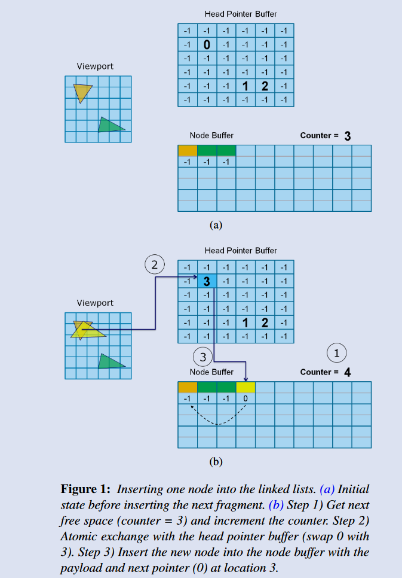
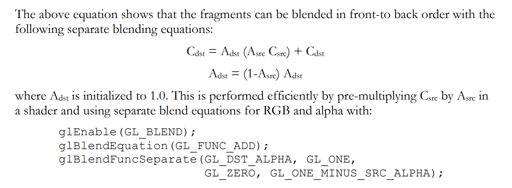
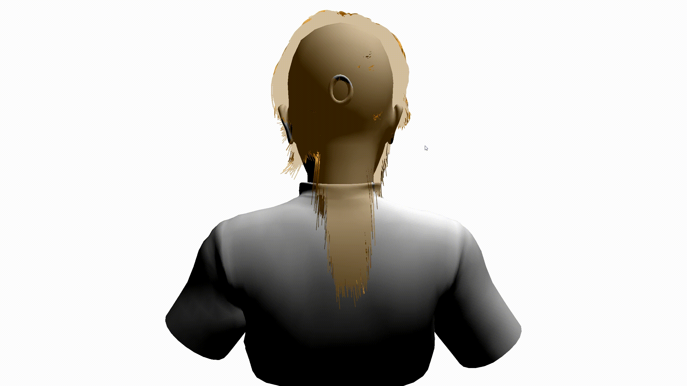
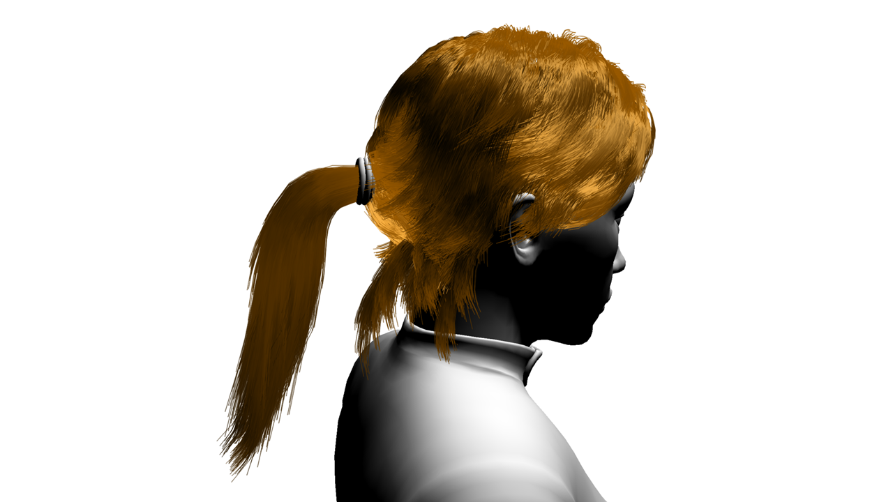

OpenGL 4.0和DirectX 11提供了原子操作(atomic operation），为GPU上并行创建链表数据结构提供了便利。基于此算法的`per-pixel link lists`可以应用到`order independent transparency`，实现像素的程序化混合，实现顺序无关的半透明效果，避免了程序员在api层面对于略显无力的排序的折磨。

# Per-Pixel Link List

PPLL的实现需要三个数据结构：头结点指针Buffer、链表Node Buffer、结点计数器。
- 头结点指针Buffer：每个像素位置又一个链表，所以叫`per-pixel link lists`,头指针Buffer的大小是framebuffer的大小，存储的是头结点在Node Buffer中的位置，初始化为一个空符号，比如-1；
- 链表Node Buffer：存储所有结点数据，可以是任意数据，`next`字段是必需的，指向链表下一个结点；不需要初始化，只需要分配足够大小。
- 结点计数器：用于分配下一个`Node Buffer`位置来存储数据，使用原子操作累加。初始化为0。

三步：
1. 从Node Buffer中获取下一个空闲位置，使用原子加计数器操作`atomicCounterIncrement`实现，每个光栅化后的片元占用一个，这个步骤是所有线程都在抢占
2. 使用原子交换操作`imageAtomicExchange`，把新的位置写入到头结点指针Buffer作为新的头结点指针，并拿出旧的头节点指针。相当于每个新节点，都从链表的头部插入，这个步骤是所有线程都在抢占
3. 把新头节点数据写入到Node Buffer，旧头节点指针作为新头节点的`next`字段

其实就是一个游标代替指针、数据存在全局大数组的链表的构造过程，描述的不好，一图胜千言：

<!--  -->


# Order Independent Transparency

每一个链表存储的是光栅化到该像素位置的所有片元数据，把这些片元按照顺序混合起来，叫做`resolve`操作，类似mutisample的resolve操作。

也是三步，论文写的比较清楚：
> 1. Render all opaque or background objects as usual, including depth testing.
> 2. Render all objects with transparency, and – instead of writing to the render target – insert the fragment data into the per-pixel linked-list structure. Depth testing is still supported, so any fragments occluded by opaque elements in the previous step will be dropped.
> 3. Resolve each linked list by first sorting and then traversing the list in sorted order for alpha blending. This is performed in a single shader pass using a full screen quad.

**Note**
- 渲染半透明物体构造PPLL时候，打开`depth test`，关闭`depth write`
- 渲染半透明物体的片元数据，通常深度测试是在`fragment shader`之后的`Per-Sample Processing`阶段，要在`fragment shader`中就拿到`depth test`的结果，需要用到`early depth test`

**像素排序**

每个链表结点数比较有限，论文[Real-Time Concurrent Linked List Construction on the GPU](https://dl.acm.org/doi/10.1111/j.1467-8659.2010.01725.x)中推荐的是插入排序。

在GLSL中实现插入排序时遇到了个经典问题，`uint`类型迭代变量递减到`-1`时候，warp到`max uint`，循环退出失败然后显存访存越界，导致屏幕黑掉一下，然后程序crash掉，还会影响到其他程序窗口的显示；让驱动小小的震撼一下。

**Blend顺序**

比较常用而且简单的混合方式是back-to-front，PPLL也不例外。但是考虑的具体实现，需要考虑背景层。如果不透明物体的渲染结果，我们能够轻易的拿到其贴图，比如vulkan的swapchain的image，或者之前的渲染的都render-to-texture（这种情况下，渲染半透明时也要绑定同样的fbo，以利用不透明pass的深度结果做深度测试），就可以轻易的使用back-to-front方式做blend；如果不能拿到不透明pass的渲染结果，比如使用OpenGL而且都往default framebuffer上渲，那就得考虑一下front-to-back的blend方式了，`Dual Depth Peeling`是最先吃螃蟹的论文。

但是论文描述里面比较费解，好像还有错误，看的头疼。可能未必是论文的问题，也许是我对SRC/DST的理解有误。`glBlendFunc`的规范里面，DST是framebuffer上的，SRC是当前渲染，跟论文好像是反的。但是整体思路就是，从front到back的每一层，先预乘alpha，同时累积之前所有层的`1.0 - alpha`的乘积，把这俩相加，再加上之前成的blend结果。看图说话吧。

<!--  -->


**遇到的问题**
1. `uint`递减到-1导致内存越界问题
2. 窗口设置最大或者相机拉近时出现严重的闪烁
<!--  -->


论文中明示了坑点：
> The size of the node buffer must be large enough to handle all possible fragments, or there must be a scheme to handle overflow.

> The creation of a node buffer can become an unreasonable burden on video memory requirements when render dimensions, the size of the node structure, and the number of fragments to store become large. For this reason it is important to be economical with those variables when circumstances allow it. For instance, the node structure can be optimized so its variables are stored in packed formats instead of floating-point vectors (fragment color in particular would benefit greatly from this approach).

- 具体原因不清，可能因为分辨率增大或者渲染占据更大面积，导致片元数量增加，PPLL的node buffer和显存有限，导致部分片元缺失，闪烁中的白色应该就是背景的颜色
- 增加node buffer的数量能够缓解，但是不能消除
- 使用`packUnorm`/`unpackSnorm4x8`压缩color居然立竿见影，消除了问题，明明数量没有变化啊；难道是因为同样的数量，没压缩之前申请的内存超出了最大值，实际申请到的node数量其实少很多？？

此处暂时没能验证，存疑~~

# 渲染结果

最后贴一张头发OIT半透明渲染的结果~

<!--  -->


# 参考
- [Real-Time Concurrent Linked List Construction on the GPU](https://dl.acm.org/doi/10.1111/j.1467-8659.2010.01725.x)
- [Order Independent Transparency with Dual Depth Peeling](https://developer.download.nvidia.com/SDK/10/opengl/src/dual_depth_peeling/doc/DualDepthPeeling.pdf)
- [【论文复现】Real-Time Concurrent Linked List Construction on the GPU](https://zhuanlan.zhihu.com/p/364762003)
- [PPLL OIT实现](https://github.com/AngelMonica126/GraphicAlgorithm/blob/master/012_Real%20Time%20Concurrent%20Linked%20List%20Construction%20on%20the%20GPU/BlendPass_FS.glsl)
- [How front-to-back blending works?](https://gamedev.stackexchange.com/questions/184285/how-front-to-back-blending-works)
- [Integer overflow](https://en.wikipedia.org/wiki/Integer_overflow)
- [packUnorm](https://registry.khronos.org/OpenGL-Refpages/gl4/html/packUnorm.xhtml)
- [unpackSnorm4x8](https://registry.khronos.org/OpenGL-Refpages/gl4/html/unpackUnorm.xhtml)