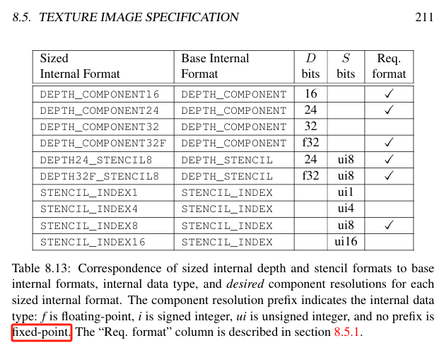

OpenGL虽然简单，但是问题也是公认的多，不同驱动实现的表现可能差异很大，导致同样的OpenGL的代码，在一台机器上正常执行，在另外一台机器上表现异常。

我这就遇到一个，采样`GL_DEPTH_COMPONENT`类型的depth texture，全屏显示到窗口。同样是GL4.6 core profile的上下文，在RTX4080上没问题，但是在笔记本ThinkPad P50（显卡NVIDIA Quadro M1000M）上结果全白色（1.0），当然P50确实太老了，10年老机了，妥妥的电子垃圾了。

可是，奈何啊，“同样是生活一起的两口子，做人的差别咋这么大咧？”。

最后查到，还是代码的问题，我使用的Texture的封装代码是直接复制网上的，没有注意相关的设置细节；另外，虽然我对OpenGL比较熟悉，但是还是有很多细节问题没怎么用过。现在的很多系统都在拥抱更现代的渲染API，OpenGL不仅落后于同时代的同侪，更落后于历史的车轮，可是还是有很多古老的系统因为跨平台的考虑在使用OpenGL，吐槽归吐槽，这砖该搬还得搬啊。

书归正传，回到正题。

# Depth Texture的比较模式

``` c++
glTextureParameteri(m_handle, GL_TEXTURE_COMPARE_MODE, GL_COMPARE_REF_TO_TEXTURE);
glTextureParameteri(m_handle, GL_TEXTURE_COMPARE_FUNC, GL_LEQUAL);
```

深度贴图，有两种采样方法。一种是作为普通贴图`normal texture`，采样深度值；另一种作为阴影贴图`shadow sampler`，使用时必须设置比较模式。在GLSL中，这两种采样方式分别对应sampler2D`和`sampler2DShadow`。如果混着使用，采样结果是未定义未定义行为。显然，我在两个显卡上跑，得到不同的结果，就是未定义行为在作怪。

> Attempting to use a texture without comparison with a shadow sampler, or vice-versa, will result in an error upon rendering. [<sup>Sampler Object Comparison Mode</sup>](https://www.khronos.org/opengl/wiki/sampler_Object#Comparison_mode)

>  the results of a texture lookup are undefined if any of the following conditions are true:
 • Thesampler used in a texture lookup function is not one of the shadow sampler types, the texture object’s base internal format is DEPTH_COMPONENT or DEPTH_STENCIL, and the TEXTURE_COMPARE_MODE is not NONE.
 • The sampler used in a texture lookup function is one of the shadow sampler types, the texture object’s base internal format is DEPTH_COMPONENT or DEPTH_STENCIL, and the TEXTURE_COMPARE_MODE is NONE.[<sup>glspec46.core p.401</sup>](https://registry.khronos.org/OpenGL/specs/gl/glspec46.core.pdf)

另外，如果`shadow sampler`设置了`linear filtering`，采样的结果实际在实现硬件的4采样PCF。

附一张OpenGL的深度数据格式表：


# 参考
- [glspec46.core p.401](https://registry.khronos.org/OpenGL/specs/gl/glspec46.core.pdf)
- [Shadow_samplers](https://www.khronos.org/opengl/wiki/Sampler_(GLSL)#Shadow_samplers)
- [Sampler Object Comparison Mode](https://www.khronos.org/opengl/wiki/sampler_Object#Comparison_mode)
- [opengl framebuffer depth texture not working](https://stackoverflow.com/questions/22919583/opengl-framebuffer-depth-texture-not-working)
- [glsl sampler2DShadow and shadow2D clarification](https://stackoverflow.com/questions/22419682/glsl-sampler2dshadow-and-shadow2d-clarification/22426507#22426507)
- [Opengl shadow acne when using shadow2D](https://stackoverflow.com/questions/19516538/opengl-shadow-acne-when-using-shadow2d)