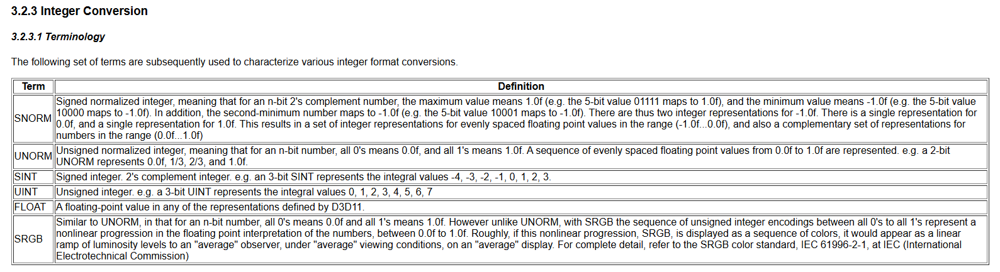
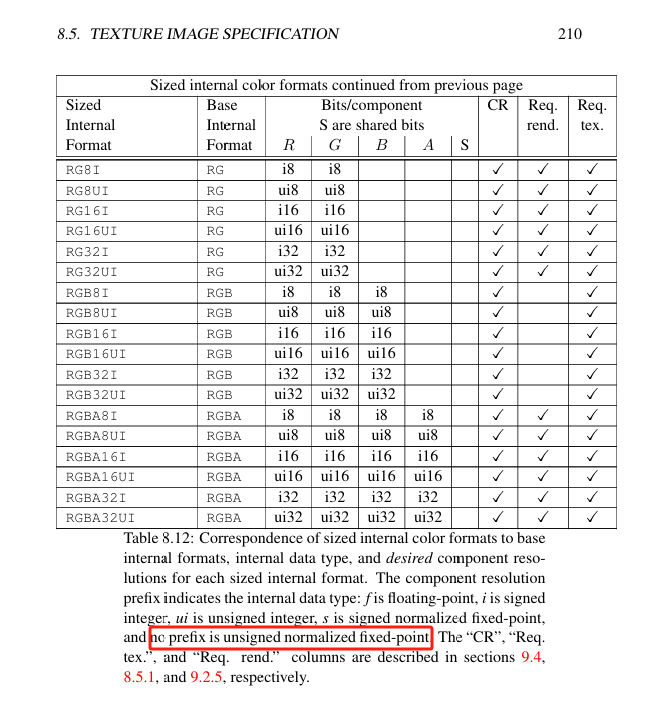
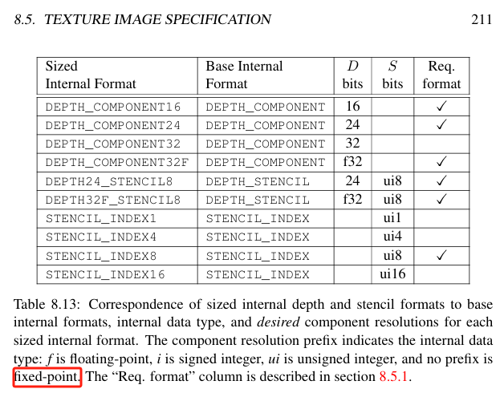

API是渲染里面最稀碎最脏的一块，砖搬的越多，问题重复遇到的可能性也越大；有些东西以前遇到过，现在又遇到了；有些以前很熟悉，现在又忘记了。虽然不一定是高明的东西，记录一下，下次再忘记可以翻一翻。古人云，“纸上得来终觉浅，好记性不如烂笔头”，诚不欺我。

今天就来记录一下，各种Graphics API里面，使用的数据格式对于定点数的处理。

数据格式这里主要记录两方面的使用，其一就是顶点数据，其二是纹理。

glVertexAttribPointer中描述，如果设置了归一化`normalized`，传入的有符号整型被归一到[-1, 1]，无符号整型被归一到[0, 1]。
> For glVertexAttribPointer, specifies whether `fixed-point data` values should be normalized (GL_TRUE) or converted directly as fixed-point values (GL_FALSE) when they are accessed.

> For glVertexAttribPointer, if normalized is set to GL_TRUE, it indicates that values stored in an integer format are to be mapped to the range [-1,1] (for signed values) or [0,1] (for unsigned values) when they are accessed and converted to floating point. Otherwise, values will be converted to floats directly without normalization. [glVertexAttribPointer](https://registry.khronos.org/OpenGL-Refpages/gl4/html/glVertexAttribPointer.xhtml)

OpenGL和Vulkan使用了同样的表述，毕竟来自同一家：
如果`vertex attributes and pixel color or depth components`表达为整数，它们通常被认为是`normalized`。在使用前会转为浮点型，转换的算法很简单，可以参考OpenGL和Vulkan的手册。
> When generic vertex attributes and pixel color or depth components are repre
sented as integers, they are often (but not always) considered to be normalized.
 Normalized integer values are treated specially when being converted to and from
 floating-point values, and are usually referred to as `normalized fixed-point`. Such
 values are always either signed or unsigned.[glspec46.core p47](https://registry.khronos.org/OpenGL/specs/gl/glspec46.core.pdf) [ Vulkan Fixed-Point Data Conversions](https://docs.vulkan.org/spec/latest/chapters/fundamentals.html#fundamentals-fixedconv)

D3D的文档写的也很清楚，而且Vulkan和DX的数据格式format enum都比较明了一些，比如Vulkan的VK_FORMAT_D24_UNORM_S8_UINT、DX的DXGI_FORMAT_D24_UNORM_S8_UINT，和OpenGL的GL_DEPTH24_STENCIL8，对比一下，是不是要吐血。
> Depth/stencil formats are considered opaque and need not be stored in the exact number of bits per texel or component ordering indicated by the format enum. However, implementations must not substitute a different depth or stencil precision than is described in the format (e.g. D16 must not be implemented as D24 or D32).[ Vulkan Depth/Stencil Formats](https://docs.vulkan.org/spec/latest/chapters/formats.html#formats-depth-stencil)

 

对于OpenGL中的corlor format和depth format，官方spec对于internal_format的描述表格里，记录了相应的解析方式；在表格说明里面，color format中无前缀的是`unsigned normalized fixed-point`，depth format中无前缀的是`fixed-point`，意思是有符号定点数，那么`GL_DEPTH_COMPONENT24`的范围就是[-1, 1]了？这还是我疑惑的一点，需要验证是不是可以直接写入负数到深度里。

**sized internal color formats**
  

**sized internal depth and stencil formats**
  

Notes-on-Data-Formats-of-Graphics-APIs
- [glVertexAttribPointer](https://registry.khronos.org/OpenGL-Refpages/gl4/html/glVertexAttribPointer.xhtml)
- [OpenGL Type](https://www.khronos.org/opengl/wiki/OpenGL_Type)
- [**vertex description for color sent as VK_FORMAT_R8G8B8A8_UNORM but consumed as vec4**](https://github.com/ocornut/imgui/discussions/6049)
- [Vulkan Identification of Formats](https://docs.vulkan.org/spec/latest/chapters/formats.html#_identification_of_formats)
- [Direct3D definition](https://microsoft.github.io/DirectX-Specs/d3d/archive/D3D11_3_FunctionalSpec.htm#3.2.3.1%20Terminology)
- [glspec46.core p47](https://registry.khronos.org/OpenGL/specs/gl/glspec46.core.pdf)
- [Vulkan Fixed-Point Data Conversions](https://docs.vulkan.org/spec/latest/chapters/fundamentals.html#fundamentals-fixedconv)