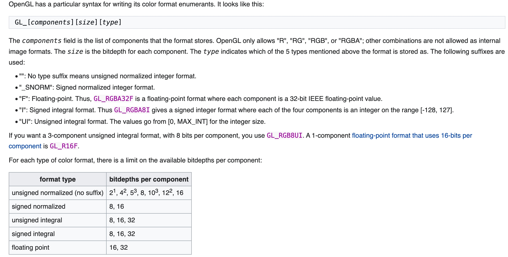

# Pixel Data相关参数
看一下`glTexImage2D`的函数签名，有三个参数比较费解，分别是`internalformat`、`format`和`type`。这三个参数相互配合，共同决定了OpenGL Texture数据的在GPU上的格式以及内存数据从CPU-〉GPU上传过程中如何被‘解析’。
``` c++
void glTexImage2D(GLenum target,
 	GLint level,
 	GLint internalformat,
 	GLsizei width,
 	GLsizei height,
 	GLint border,
 	GLenum format,
 	GLenum type,
 	const void * data);
```
[Difference between format and internalformat](https://stackoverflow.com/questions/34497195/difference-between-format-and-internalformat)中说的很直截了当，`internalFormat`决定GPU，`format/type`决定CPU数据。
> The `format` (7th argument), together with the `type` argument, describes the data you pass in as the last argument. So the `format/type` combination defines the memory layout of the data you pass in.
> `internalFormat` (2nd argument) defines the format that OpenGL should use to store the data internally.


这个描述是否让你觉得，如果`data`参数为null，`format/type`就不需要设置，或者随意设置了，答案是否定的。 对于`glTexImage2D`来说，不管`data`参数是否为null，`internalFormat`和`format/type`一定要是兼容的组合。

> **Note** Even if data is NULL, the format and type fields must be legal fields, or the entire call will fail with a GL_INVALID_ENUM error.[<sup>Texture_Storage</sup>](https://www.khronos.org/opengl/wiki/Texture_Storage)


`glTexImage2D`做了两件事情，分配显存，并上传数据，所以需要格式的兼容，这个过程也被称作`Mutable Storage`。 还有一组`Immutable Storage`的分配方式，把`glTexImage2D`的分配显存和上传数据的两个过程分开了，如此，在某些情况下（比如Texture as RT），可以不关心`format/type`的设置了。
``` c++
void glTexStorage2D( GLenum target​, GLint levels​, GLint internalformat​, GLsizei width​, GLsizei height​ );
void glTexSubImage2D(GLenum target​, GLint level​, GLint xoffset​, GLint yoffset​, GLsizei width​, GLsizei height​, GLenum format​, GLenum type​, const GLvoid * data​);
```

# Pixel Data Internal Format

`internalFormat`和`format/type`，首先确定`internalFormat`，然后在确定与其兼容的`format/type`，类型的兼容之时最低要求，如果没有正确设置这三个参数，数据在上传的时候，会有类型转换。

举个例子，参考下面的格式语法，如果你想要4通道每个通道都是浮点型的格式，设置`internalFormat`为`GL_RGBA`，`format/type`为`GL_RGBA/GL_FLOAT`。`GL_RGBA`表示`unsigned normalized integer format`，且每格通道8位，


# 参考
- [Color Formats](https://www.khronos.org/opengl/wiki/Image_Format#Color_formats)
- [gl_texture_format_util.hpp](https://gist.github.com/alexsr/034bb802ae43a1adb0863b735fda0ab9)
- [OpenGL image formats](https://gist.github.com/Kos/4739337)
- [Difference between format and internalformat](https://stackoverflow.com/questions/34497195/difference-between-format-and-internalformat)
- https://chromium.googlesource.com/external/github.com/KhronosGroup/OpenXR-SDK/+/9d9ae386adf791576a839ceb733cc577224b7985/external/include/vulkan/vk_format.h
- https://github.com/KhronosGroup/Vulkan-Samples-Deprecated/blob/master/external/include/vulkan/vk_format.h
- https://github.com/KhronosGroup/Vulkan-Samples-Deprecated/blob/master/external/include/GL/gl_format.h
