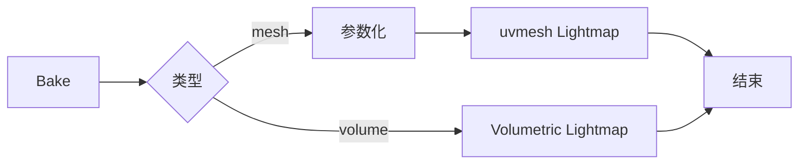
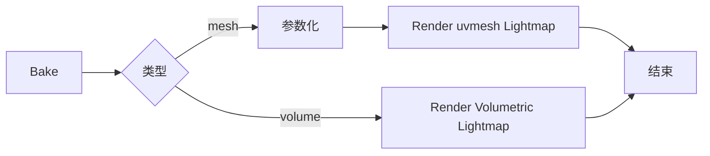

不太会画各种流程图，但是有时候又不得不画一个糙图交差。之前倒是用过puml，但是想用一个又简单又能立即显示的工具，简单找了一下文本生成流程图的做法，第一种markdown中写`mermaid`最为简单直观；第二种$\LaTeX$的`TikZ`，很重型了，但是排版起来会很好看。

## Mermaid

Mermaid 是一个用纯文本生成图表的 JavaScript 库。通过mermaid语法描述图的结构和关系，它就能自动渲染成流程图、时序图、甘特图等可视化图表，不需要手动拖拽画图。

比如，描述bake场景中模型和体素的简单流程图，如下：

````

````

流程图效果：



## TikZ

TikZ 是 $\LaTeX$宇宙的一个（著名的）绘图宏包，到[LaTeX and TikZ examples](https://texample.net/)看一看，你会发现TikZ简直无所不能，包容万象。

我不会TikZ这重剑无锋的大杀器，做个流程图对于TikZ也是小儿科，但是我依然不会，这是我用AI生成并调整参数的结果。TikZ厉害的地方就在于，事无巨细的设定了绘图中的关系、数量，精确而稳定。基本逻辑就是，先定义节点和节点的形状、相对位置信息，再定义节点之间的连接关系、连接线的属性。比如`--`是直线，`-|`是折线。

``` latex
\documentclass[tikz, border=5pt]{standalone}
\usepackage{ctex}
\usetikzlibrary{shapes.geometric, arrows.meta, positioning}

\begin{document}
	\begin{tikzpicture}[
		node distance = 0.9cm and 1.8cm,
		every node/.style = {font=\small},
		box/.style     = {rectangle, draw, rounded corners=3pt,
			minimum width=2.2cm, minimum height=0.65cm, align=center},
		decision/.style = {diamond, draw, aspect=2.2,
			minimum width=2.8cm, minimum height=0.7cm, align=center},
		arrow/.style   = {-{Stealth[length=5pt]}, thick},
		]
		\node[box]                                    (A) {Bake};
		\node[decision, right=0.5cm of A]             (B) {类型};
		\node[box, above right=0.7cm and 1.0cm of B]  (C) {参数化};
		\node[box, below right=0.7cm and 3.0cm of B]  (D) {Render\\Volumetric Lightmap};
		\node[box, right=1.0cm of C]                  (F) {Render\\uvmesh Lightmap};
		\node[box, below right=0.7cm and 1.0cm of F]  (E) {结束};
		
		\draw[arrow] (A) -- (B);
		\draw[arrow] (B) -- node[above, sloped, font=\footnotesize]{mesh}   (C);
		\draw[arrow] (B) -- node[below, sloped, font=\footnotesize]{volume} (D);
		\draw[arrow] (C) -- (F);
		\draw[arrow] (F) -- (E);
		\draw[arrow] (D) -- (E);
	\end{tikzpicture}
\end{document}
```

首先生成个只包含图标范围的pdf，再使用pdf2svg或者其他工具把pdf转成矢量格式或者图片格式。
上面的$\LaTeX$片段最终生成矢量流程图如下：


## 参考
- [TikZ 的简介、资源以及学习方法](https://zhuanlan.zhihu.com/p/48300815)
- [LaTeX and TikZ examples](https://texample.net/)